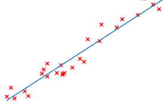
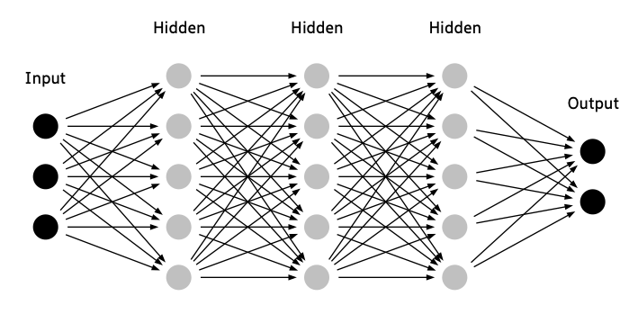

<h2 class="page-title">Webinar</h2>

A webinar where I explain about the basic math concepts in ML and DL. Attended by more than 200+ students all over India and got a very good feedback.  
    

        <iframe class="embed-responsive-item" src="https://www.youtube.com/embed/9wVjTK6Fv1k" frameborder="0"
        allow="accelerometer; autoplay; clipboard-write; encrypted-media; gyroscope; picture-in-picture"
        allowfullscreen></iframe>
    

     
    
Watch in youtube - <a
            href="https://youtu.be/9wVjTK6Fv1k?t=3" target="_blank">link</a>

<figure class="shadowhover hover-pointer" id="30d93745-10b8-4d7b-8132-a60d740499d6"><a href="https://youtu.be/9wVjTK6Fv1k?t=3" class="bookmark source" target="_blank">
        

            

                
Ml and DL Webinar

                
Webinar on Machine Learning and Deep Learning - The math you need
                    to get started. Organized by: ECE Department and Networking club.
                

            

            
youtube

        

    </a></figure>

    

Github repo for all the resources and a blog post for
        future reference

<figure class="shadowhover hover-pointer" id="e70359e8-502a-4a47-bf8c-97fa7fcbe03b"><a
        href="https://github.com/bharathikannann/Python/tree/master/Webinar" target="_blank" class="bookmark source">
        

            

                
bharathikannann/Python

                
Artificial intelligence (AI) is the broad science of mimicking
                    human abilities, machine learning is a specific subset of AI that trains a machine how to learn.
                    Machine learning is a field of study that gives computers the ability to learn without being
                    explicitly(clearly) programmed.

            

            
bharathikannann

        

    </a></figure>

    <strong>Organized by:</strong> 
    <strong><i>ECE Department and Networking club, Sri Eshwar College of Engineering</i></strong>, Coimbatore, Tamil Nadu. 
    <strong>Resource Person</strong> 
    <strong><i>&nbsp;&nbsp;N Bharathi kannan</i></strong>, IV ECE. 
    <strong>Staff Cordinators</strong> 
    <strong><i>&nbsp;&nbsp;Mr. J. Dhanasekar</i></strong>, AP/ECE, 
    <strong><i>&nbsp;&nbsp;Mr.S. Deepak</i></strong>, AP/ECE. 
    <strong>Student Cordinators</strong> 
    <strong><i>&nbsp;&nbsp;M Anish</i></strong>, IV ECE, 
    <strong><i>&nbsp;&nbsp;S Mantharagiri</i></strong>, III ECE. 
    College website : <a href="http://sece.ac.in/" target="_blank">sece.ac.in</a>
 
<h3 id="40c55321-24b2-4a23-a9ca-0ef6086f2166" class="">Table of contents (blog)</h3>
<ul id="cb7b71c6-46df-48db-82e9-28ba2ed7660c" class="bulleted-list">
    <li><a href="https://github.com/bharathikannann/Python/tree/master/Webinar#machine-learning">Machine
            Learning</a>
        <ul id="6556cda3-3fcc-46f5-b434-3a8979d0f11a" class="bulleted-list">
            <li><a href="https://github.com/bharathikannann/Python/tree/master/Webinar#machine-learning-algorithms">Machine
                    Learning Algorithms</a></li>
        </ul>
        <ul id="213af39d-7313-44fd-8abc-0141bb4bf355" class="bulleted-list">
            <li><a href="https://github.com/bharathikannann/Python/tree/master/Webinar#supervised-learning">Supervised
                    Learning</a>
                <ul id="830f4fcf-df8c-448c-a0b9-a181f003de51" class="bulleted-list">
                    <li><a href="https://github.com/bharathikannann/Python/tree/master/Webinar#linear-regression">Linear
                            Regression</a>
                        <ul id="63929acf-bf3a-4fa4-b3f7-5430868dc3ec" class="bulleted-list">
                            <li><a
                                    href="https://github.com/bharathikannann/Python/tree/master/Webinar#hypothesis-function">Hypothesis
                                    Function</a></li>
                        </ul>
                        <ul id="403d4b71-1d92-406b-b70a-98ced1de4c2e" class="bulleted-list">
                            <li><a
                                    href="https://github.com/bharathikannann/Python/tree/master/Webinar#cost-function">Cost
                                    Function</a></li>
                        </ul>
                        <ul id="26319521-17cb-4de2-b7cd-d32ff8160baa" class="bulleted-list">
                            <li><a
                                    href="https://github.com/bharathikannann/Python/tree/master/Webinar#gradient-descent">Gradient
                                    Descent</a></li>
                        </ul>
                        <ul id="8a4cc7f9-dacb-4abc-9f18-f8899f8ccbac" class="bulleted-list">
                            <li><a
                                    href="https://github.com/bharathikannann/Python/tree/master/Webinar#linear-regression-from-scratch-in-python">Linear
                                    Regression from scratch in python</a></li>
                        </ul>
                        <ul id="0c7db12c-fe93-44b4-b554-0fd1868f847d" class="bulleted-list">
                            <li><a
                                    href="https://github.com/bharathikannann/Python/tree/master/Webinar#multiple-variables">Multiple
                                    Variables</a></li>
                        </ul>
                        <ul id="fe6dc5f2-3294-4199-8b02-3d76d8e86cea" class="bulleted-list">
                            <li><a
                                    href="https://github.com/bharathikannann/Python/tree/master/Webinar#polynomial-regression">Polynomial
                                    Regression</a></li>
                        </ul>
                    </li>
                </ul>
                <ul id="b855e2d4-e9a0-40e9-9237-4259b2040396" class="bulleted-list">
                    <li><a href="https://github.com/bharathikannann/Python/tree/master/Webinar#logistic-regression">Logistic
                            Regression</a></li>
                </ul>
                <ul id="b4e68ae4-7d85-409d-bccd-32c0d40b2252" class="bulleted-list">
                    <li><a href="https://github.com/bharathikannann/Python/tree/master/Webinar#one-vs-all">One Vs
                            All</a></li>
                </ul>
                <ul id="65355a53-eac1-4a90-8c7e-3a12f4dba025" class="bulleted-list">
                    <li><a
                            href="https://github.com/bharathikannann/Python/tree/master/Webinar#regularization">Regularization</a>
                    </li>
                </ul>
                <ul id="30cb886b-e996-4e89-9c4c-3d0f8d0fc958" class="bulleted-list">
                    <li><a
                            href="https://github.com/bharathikannann/Python/tree/master/Webinar#vectorization">Vectorization</a>
                    </li>
                </ul>
            </li>
        </ul>
        <ul id="0e0a6735-75ae-4c9d-a243-9232fda5a1aa" class="bulleted-list">
            <li><a href="https://github.com/bharathikannann/Python/tree/master/Webinar#unsupervised-learning">Unsupervised
                    Learning</a>
                <ul id="54f6fc79-7c57-4f2f-a729-aba9144e1837" class="bulleted-list">
                    <li><a
                            href="https://github.com/bharathikannann/Python/tree/master/Webinar#clustering">Clustering</a>
                    </li>
                </ul>
                <ul id="32742af4-aeb7-49b6-a278-e2e3c843c36c" class="bulleted-list">
                    <li><a
                            href="https://github.com/bharathikannann/Python/tree/master/Webinar#application">Application</a>
                    </li>
                </ul>
            </li>
        </ul>
        <ul id="47e6345b-6a7d-49de-b784-94b98251c304" class="bulleted-list">
            <li><a href="https://github.com/bharathikannann/Python/tree/master/Webinar#reinforcement-learning">Reinforcement
                    Learning</a></li>
        </ul>
    </li>
</ul>
<ul id="2a3b784b-af74-4299-bc09-d7e0155e5232" class="bulleted-list">
    <li><a href="https://github.com/bharathikannann/Python/tree/master/Webinar#deep-learning">Deep Learning</a>
        <ul id="754fd1c8-add5-4d49-abf7-beb7c7460579" class="bulleted-list">
            <li><a href="https://github.com/bharathikannann/Python/tree/master/Webinar#neural-networks">Neural
                    Networks</a>
                <ul id="d4420601-f68f-4939-aaf0-0a6f51028478" class="bulleted-list">
                    <li><a
                            href="https://github.com/bharathikannann/Python/tree/master/Webinar#neural-networks-from-scratch-in-python">Neural
                            Networks from scratch in python</a></li>
                </ul>
            </li>
        </ul>
        <ul id="1b81a3ce-0879-4395-a9f5-bec28efe0245" class="bulleted-list">
            <li><a
                    href="https://github.com/bharathikannann/Python/tree/master/Webinar#convolutional-neural-networks">Convolutional
                    Neural Networks</a></li>
        </ul>
        <ul id="f7aef8b0-6529-4241-aec7-bc96f165f994" class="bulleted-list">
            <li><a href="https://github.com/bharathikannann/Python/tree/master/Webinar#recurrent-neural-networks">Recurrent
                    Neural Networks</a></li>
        </ul>
    </li>
</ul>

 
<h3 id="58734e29-772e-4979-9c21-506c0d0580db" class="">Regression Visualization online links :</h3>

These can we viewed without installing the
        software

    <ul id="e6d74de1-531e-4304-9df3-7dcec7f86fc5" class="bulleted-list">
        <li>Linear Regression and Polynomial Regression 2D - <a href="https://www.geogebra.org/classic/fuvr2rje">link</a></li>
    </ul>
    <ul id="7206db9a-69a2-4156-974b-c37433992f5a" class="bulleted-list">
       <li>Linear Regression and Polynomial Regression 3D - <a href="https://www.geogebra.org/classic/nfsdcexr">link</a> </li>
    </ul>
    <ul id="0aa85299-1f94-4db9-92ad-31796ee7bd32" class="bulleted-list">
        <li>Logistic Regression 2D - <a href="https://www.geogebra.org/classic/mpr6qtee">link</a> </li>
    </ul>
    <ul id="035ec1a5-6716-45a0-8722-75df84da62de" class="bulleted-list">
        <li>Logistic Regression 3D - <a href="https://www.geogebra.org/classic/gp8anaxf">link</a> </li>
    </ul>

      
    

    

    
 
    <h3 id="745bfd6f-6426-4feb-8440-0260ab0eaf28" class="">Linear Regression Code in Scikit-learn notebook + Exercise
    </h3>
    <figure class="shadowhover hover-pointer" id="9a5468d4-81c6-462e-947c-61f9526d1247"><a
            href="https://github.com/bharathikannann/Python/blob/master/Webinar/LinearRegression/LinearRegression.ipynb" target="_blank"
            class="bookmark source">
            

                

                    
bharathikannann/Python

                    
It includes two problems with datasets taken from kaggle and implemented for you. Includes 1 exercise for practice.

                

                
bharathikannann
                

            

        </a></figure>
    <h3 id="ed2cdb39-a3e9-4163-aa61-1140fcee5fd9" class="">Linear Regression Code from Scratch notebook</h3>
    <figure class="shadowhover hover-pointer" id="f216e641-b170-4caf-9c4f-4ae257d91e56"><a
            href="https://github.com/bharathikannann/Python/blob/master/Webinar/LinearRegressionfromscratch/LinearRegressionfromscratch.ipynb" target="_blank"
            class="bookmark source">
            

                

                    
bharathikannann/Python

                    
Linear Regression Implemented from scratch in python to understand how it works. However it is not efficient as implemented using Scikit-learn.

                

                
bharathikannann
                

            

        </a></figure>
    

    
 
    <h2 id="a4f19042-99ad-4854-9e8e-d58d183eb419" class="">Important links</h2>
    
Try experimenting with learning rate (∝)

    <figure class="shadowhover hover-pointer" id="70b2fd9a-26f8-4a7d-94a4-e3633c8c98d5"><a
            href="https://developers.google.com/machine-learning/crash-course/fitter/graph" target="_blank" class="bookmark source">
            

                

                    
Optimizing Learning Rate

                    
Experiment with different learning rates and see how they affect the number of steps required to reach the minimum of
                    the loss curve. Try the exercises below the graph.

                

                
developers.google.com
                

            

        </a></figure>
    <h3 id="22d0f3b8-1b05-4be2-9b49-9d630cec2c0a" class="">Reinforcement learning</h3>
    
Google atari breakout youtube video

    

        <iframe class="embed-responsive-item" src="https://www.youtube.com/embed/TmPfTpjtdgg"></iframe>
    

     
    
Alpha go Documentary

    <figure class="shadowhover hover-pointer" id="cb7687c1-4cc5-4db6-b20b-9428c7aba7c1"><a href="https://www.youtube.com/watch?v=WXuK6gekU1Y" target="_blank"
            class="bookmark source">
            

                

                    
AlphaGo - Full Documentary

                    
With more board configurations than there are atoms in the
                        universe, the ancient Chinese game of Go has long been considered a grand challenge for
                        artificial in...

                

                
youtube

            

        </a></figure>
    
Multi Agent Hide and Seek game from Open AI
    

    

        <iframe class="embed-responsive-item" src="https://www.youtube.com/embed/kopoLzvh5jY"></iframe>
    

    

    
 
    <h2 id="e628d9b0-f5fb-40b3-a08b-c4f520916f8e" class="">Tensorflow Playground</h2>
    <figure class="shadowhover hover-pointer" id="37caede6-8673-41e3-a551-293d19deb861"><a
            href="https://playground.tensorflow.org/#activation=tanh&amp;batchSize=10&amp;dataset=circle&amp;regDataset=reg-plane&amp;learningRate=0.03&amp;regularizationRate=0&amp;noise=0&amp;networkShape=4,2&amp;seed=0.73792&amp;showTestData=false&amp;discretize=false&amp;percTrainData=50&amp;x=true&amp;y=true&amp;xTimesY=false&amp;xSquared=false&amp;ySquared=false&amp;cosX=false&amp;sinX=false&amp;cosY=false&amp;sinY=false&amp;collectStats=false&amp;problem=classification&amp;initZero=false&amp;hideText=false"
            class="bookmark source">
            

                

                    
Neural Network Playground

                    
It&#x27;s a technique for building a computer program that learns
                        from data. It is based very loosely on how we think the human brain works.

                

                
developers.google.com
                

            

        </a></figure> 
    <h3 id="22aee38c-3d18-4dce-ac83-44ea7a7172ce" class="">Neural Networks from scratch code (bonus)</h3>
    <figure class="shadowhover hover-pointer" id="99a8b960-c85c-4310-ac9e-c0b6d4ab6bd8"><a
            href="https://github.com/bharathikannann/Python/tree/master/ML/Neural%20Networks" target="_blank"
            class="bookmark source">
            

                

                    
bharathikannann/Python

                    
A Neural Network implemented from scratch in python to understand how it works.

                

                
bharathikannann
                

            

        </a></figure>
    

    
 
    <h3 id="19cdf523-fb90-4a7c-b120-7431197b26d0" class="">Convolutional Neural Networks</h3>
    
Live demo

    <figure class="shadowhover hover-pointer" id="1e533aba-a621-4d1f-ba6f-773f54441f30"><a href="http://poloclub.github.io/cnn-explainer/" target="_blank"
            class="bookmark source">
            

                

                    
CNN Explainer

                    
An interactive visualization system designed to help non-experts
                        learn about Convolutional Neural Networks (CNNs).

                

                
poloclub.github.io

            

        </a></figure>
    

    
 
    <h3 id="8c35210c-a282-49bd-91c5-1428c2b4d56a" class="">References</h3>
    <ul id="f0895060-7c7d-4093-bdaa-8e0bc033e32c" class="bulleted-list">
        <li><a href="https://www.coursera.org/learn/machine-learning">Machine Learning</a> course by Andrew NG
            (coursera)</li>
    </ul>
    <ul id="255ead6f-520f-4537-87c8-f1935f596867" class="bulleted-list">
        <li><a href="https://www.coursera.org/specializations/deep-learning">Deep Learning Specialization</a> by Andrew
            NG (coursera)</li>
    </ul>
    <ul id="b3a7007f-1eee-4b55-8749-7deab203e20f" class="bulleted-list">
        <li><a href="https://developers.google.com/machine-learning/crash-course/ml-intro">Machine Learning crash
                course</a> from google</li>
    </ul>

