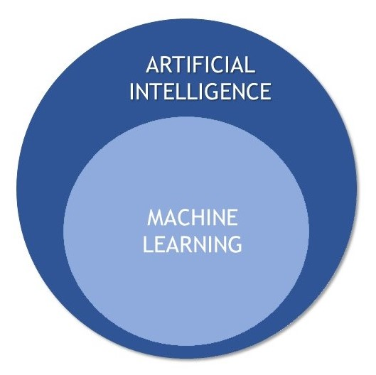
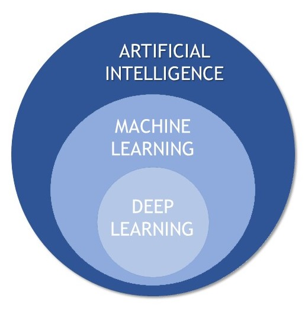
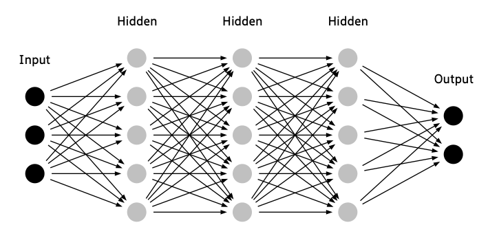
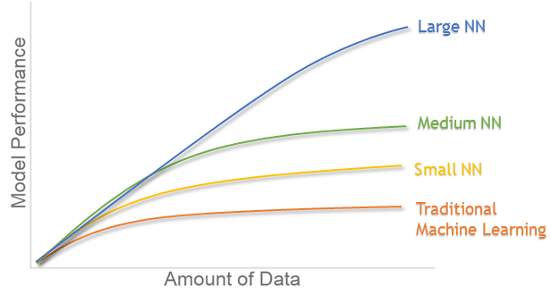
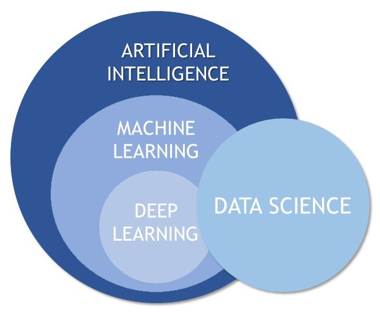
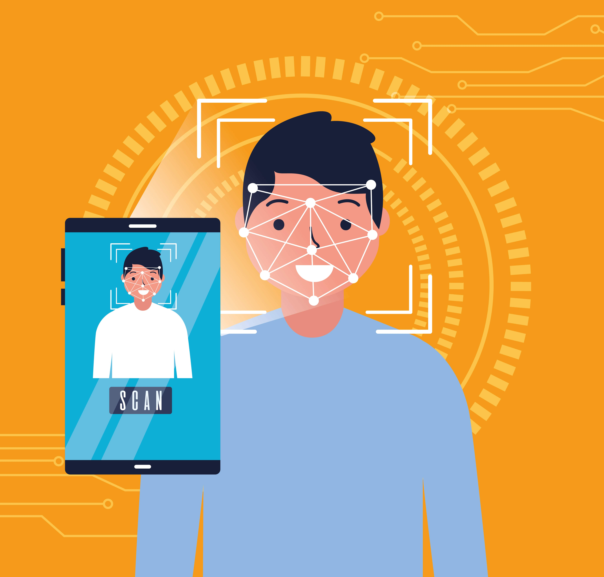

**Artificial Intelligence** is all around us, say from netflix movie suggestions, facial recognition in our mobile phone, speech recognition, chatbots and much more. It has made a significant progress in the recent years.

> Artificial intelligence (AI) is the ability of computers to think and act like humans.

**Go** is one of the most complex board game in existance. This game was invented in china more than 2500 years ago and continuously played by us to the present day.

    

        

            

                

        

    

    

        

            

                <a class="featured-article-img-credits" href='https://www.wikipedia.org/'>Source -Wikipedia</a>
            

        

    

It is a two player game and they can use either white or black stone(*pieces*). The goal is to capture more territory. It looks simple but it is one of the most complex games in existance.

There are over $$10^{170}$$ possible moves which is more than the number of atoms in the universe. So predicting is so hard and storing all the possible moves is huge.

In 2016 **Google's Deepmind Alpha go** beat 18 times world champion **Lee Sedol** in four out of five games. This looks very impressive and you can understand the power of AI.

We still have AI that can perform only specific task which is described as the Artificial Narrow Intelligence(ANI). Researchers are working to create **Artificial General Intelligence(AGI)** and is beleived to be acheived before 2050. AGI can perform any task that humans can.

#### The Origin and Importance Artificial Intelligence

The term Artificial Intelligence was coined in *1955* by **John McCarthy** and it let to the creation of Machine learning and Deep learning.

Today the data generated by us is huge and becomes hard to obsorb, interpret and make complex decisions based on that data. So AI can be used find complex patterns in data that we will struggle to discover.

AI reduces the human effort as much as possible and makes our lives easier.

#### What is Machine Learning?

Machine Learning is a subset of AI. We know that AI is like mimicking human abilities. Any technique can be used to solve this problem. In that Machine learning is the most commonly used method.

> Machine learning is a field of study that gives computers the ability to learn without being explicitly(clearly) programmed.

Instead of writing the logic of the code you will feed in the data to the algorithm and it will build a logic based on the data.

#### What is Deep Learning?

Deep learning is a branch of machine learning which is completely based on **artificial neural networks**.

> Neural Network is going to mimic the human brain.

#### Neural Networks

Neural networks are used to solve complex problems people face in real-world situations. These networks can learn and model the relationships between inputs and outputs that are complex and nonlinear.

<h6><u>Neural Network Structure</u></h6>

#### Why Deep Learning?

Deep learning is more powerful when it comes to complex problems and its **performance increases** when we have more and more data while normal machine learning algorithms don't perform well.

#### What is Data Science?

In our modern world data is produced in huge chunks. We need to handle and process the data with minimum effort. This **processing and handling of data** is called data science.

> Data science is a field of study of data that involves getting, storing and analyzing data effectively to extract useful information from structured or unstructured data.

#### Applications

Every industry has a high demand for Artificial Intelligence. Some examples in our day to day life.

- *Smart assistants* like Amazon's Alexa, Google assistant, Apple's siri use AI.
- *Chatbots* use AI to understand the meaning of the sentense and be more human like.
- *Facial recognition* in our smart phone.

    

        

            

            

        
 
    

    

        

            <a class="featured-article-img-credits" href='https://www.freepik.com/vectors/technology'>Technology vector created by gstudioimagen - www.freepik.com</a>
            

        
   
    

- In Netflix movie *recommendations* to know what you mostly like.
- *Google maps* to predict the fastest route.
- *Email spam* filtering.
- Social media platforms use AI to give users a *personalised newsfeed* and they also use it to show the relevant ads according to your interest.
- *E-commerce websites* such as amazon and flipkart uses AI to show the products according to your interest in their homepage.
- *Google search engine* uses AI to find the relevent search results to your queries.

    

        

            
  
                
                

        

    

    

        

            

                <a class="featured-article-img-credits" href='https://www.freepik.com/vectors/technology'>Technology vector created by freepik - www.freepik.com</a>
            

        

    

They are not just limited to personal assistants and online platforms but it is also used in many sectors like
- Automobiles,
- Healthcare,
- Gaming,
- Finance,
- Manufacturing, etc..,

#### Advantages of AI

- They can make faster decisions.
- Helps in repetitive tasks.
- Reduces human error.
- They can take risk instead of humans in tough situations.
- They can work continuously for long period of time.

#### Disadvantage of AI

- Makes us *lazy* and it will do most of the things for us.
- Unemployment due to automation of many repetitive tasks.
- They have *no emotions* for us and it just do what they need to do.

#### Summary

There are huge advantages and some disadvantage in AI. Every technology has some disadvantage and we need to make sure that we are using it in the right way. Still now there are no AI applications like skynet or robots that are dangerous to us. We need to use this technology is a positive way and make this world a better place.

