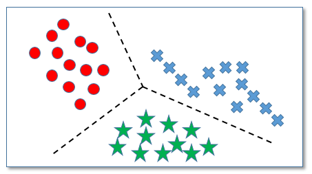
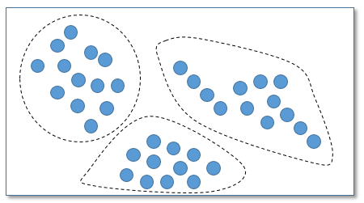
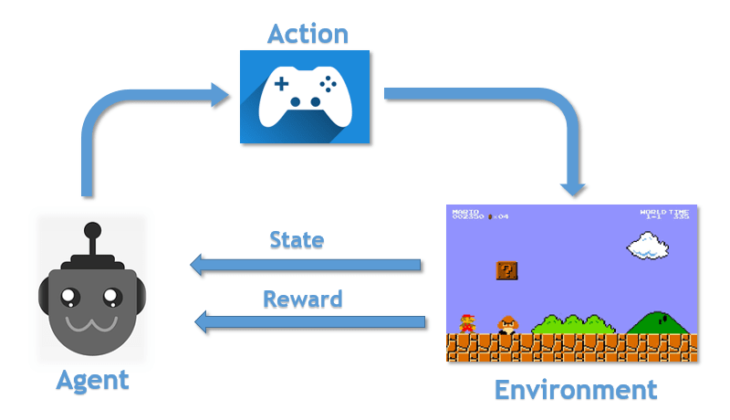
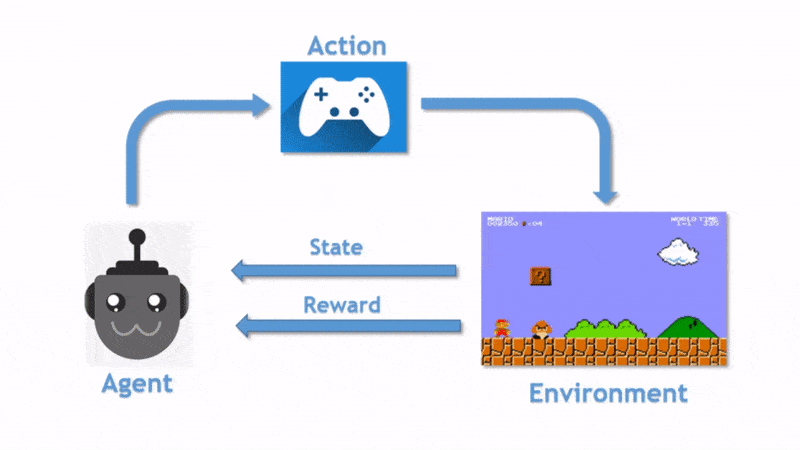

> Machine learning is a field of study that gives computers the ability to learn without being explicitly(clearly) programmed.

Instead of writing the logic of the code you will fead in the data to the algorithm and it will ***build a logic based on the data***.

For example if you want to write a logic for a program that will try to identify a dog. How will you manually find all the patterns in the dog and write a logic for it. It is a very complex task and imagine the number of classes(*cats, cars,etc..*) we have.

So we will let the **machines to find patterns** in the data that we will struggle to discover. This approach is easily scalable and we can use specific algorithms according to the problem we are solving.

#### Machine Learning Algorithms

- There are three main types of Machine learning algorithms
    - Supervised learning
    - Unsupervised learning
    - Reinforcement learning

### Supervised learning

>Supervised learning is when the model getting **trained on a labelled dataset**. Labelled dataset is one which has both input(*X*) and output(*Y*) parameters.

 

**Example**   Given **area** of the houses(*input parameter X*) and their **prices**(*output parameter Y*) predict the price for the new area.

Here we have both input and output parameters and the model learns to find some patterns from the data and uses that model for future predictions.

It is called supervised learning because it can be thought of as a teacher supervising the training process. We have both input and output parameters so the mistakes by the model can be corrected iteratively.

- It is further classified into
    - Regression
    - Classification
 

#### Regression

- Here we are trying to predict results within a continuous output, meaning that we are trying to map input variables to some **continuous function**.
- Given the picture of a person, We have to predict his/her age(*Continuous*).

#### Classification

- Here we are trying to map input variables into **discrete categories**.
- Given the picture of a person, We have to predict their gender (*Male/Female*).

### Unsupervised learning

>Unsupervised learning allows us to approach problems with little or no idea what our outputs should look like.

The main goal is to find structure or patterns in the underlying data. 
Here there will be only **unlabelled data**(*inputs-X only*). 
It is called unsupervised learning because there are no correct answers in the training dataset.

- Applications
    - Social Network Analysis
    - Astronomical Data Analysis
    - Anomaly detection
 
 
- It is further classified into
    - Clustering
    - Association

#### Clustering

This algorithm is used to find **clusters**(*groups*) in the data. Grouping the data will help you to understand more about the data.

This problem becomes supervised learning(*classification*) if we have labelled dataset. You just need to specify how many groups you need and the algorithm will automatically group the data into the number of groups you specified.

#### Association

Association rule shows **how frequently an itemset** occurs in a dataset. It finds relationships between different entities.

For example 
A person who buys apple will usually buys orange. Here we are using large dataset of transactions in a supermarket to find items that are brought together.

>It learns that people who buy X also tend buy Y.

#### Semi-Supervised machine learning

Semi-Supervised falls between supervised and unsupervised learning. Here the problems will have **large amounts of input data(*X*)** and only **few output data(*Y*)** in the training dataset.

Many real world datasets fall into this category. Labelling a large dataset is time consuming and expensive(*Imagine the time that would take to read thousands of articles to attribute just one class*). Semi-Supervised algorithms are able to train from these few labelled outputs in a large dataset.

### Reinforcement learning

For understanding this lets start with an example,  Imagine you are playing a supermario videogame for the first time and given the controller for you. You first don't know anything about the game and you will start to interact with the game by pressing the buttons.

 
You press right and get the coin you will be rewarded(*+1*) and again you press right, you fall and gets out(*-1 reward*).

By interacting with the environment through trail and error you learned that you need to get coins without falling down in the holes and also to reach end. So here without any supervisor you will learn how to play. By playing more and more games you will just get better and better.

Reinforcement learning is just the computational approach of solving this problem.

> In reinforcement learning we will build an agent that will learn to take actions in the environment by interacting with it through trail and error and its goal is to maximize the cumulative reward.

#### Reinforcement learning processes

 

The agent receives the first state **S0** from the environment(*First frame of the game*). Then the agent takes the action **A0** and the agent moves to the new state **S1**.

Then the agent receive **R1** (*a reward*) based on that action **A0** and its main goal is to maximize its reward.

>From state **S0** takes action **A0** to move into state **S1** and gets reward **R1**

This process continues until we gets out. The agent plays more and more games and improves itself.

 

This is the main concept in reinforcement learning.

