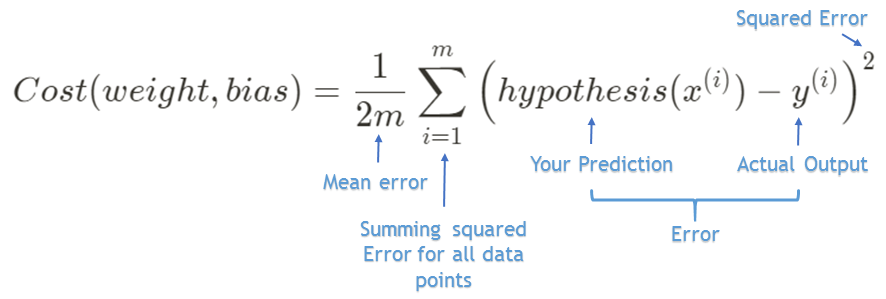
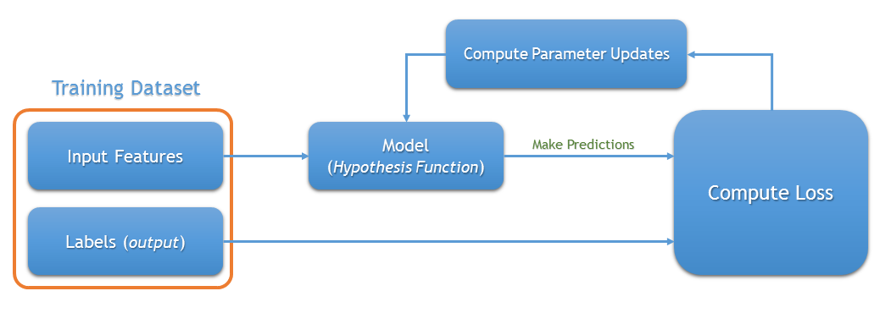

### A little intro to types of Machine Learning Algorithms

- There are three main types of Machine learning algorithms
    - Unsupervised learning
    - Reinforcement learning
    - Supervised learning

### Supervised learning

Supervised learning is when model is getting **trained on a labelled dataset**. Labelled dataset is one which has both *input(X)* and *output(Y)* parameters.

**Example** 

Given the *area* of the *houses*(input parameter X) and their *prices*(output parameter Y) predict their price for the new area. Here we have both input and output parameters and the model learns to find some patterns from the data and uses that model for *future predictions*.

- It is further classified into
    - Regression
    - Classification

### Regression

Here we are trying to predict results within a **continuous output**, meaning that we are trying to map input variables to some continuous function.

For Example  Given a picture of a person, We have to predict his/her age(Continuous).

### Classification

Here we are trying to map input variables into **discrete categories**.

For Example  Given a picture of a person, We have to predict their gender (Male/Female) (Discrete).

### Linear Regression

Linear regression is one of the **simplest machine learning model** out there and it is the first type of regression to learn. It's simplicity makes it a *great stepping stone to learn more complex machine learning algorithms*. In this post we will explore the foundation of linear regression.

> Linear regression attempts to model the relationship between two variables by fitting a linear equation to observed data.

They explain the relationship between **one dependent variable** and **one or more independent variable**. Here the dependent variable is the ***output**(Y)* and the independent variable is the ***input**(X)*. Remember it as features, there can be only one output feature(Y) and many input features(X).

As an example,   For predicting the price of the house, consider input features as *area, place, no of rooms and age of the house* and output feature as the *price*. It is a multiple linear regression since there is more than one input feature(X). If we consider a single input feature it is a simple linear regression.

Here we will just use one input feature(area) as an example to explain how linear regression works.

A simple equation for linear regression can be defined as

$$y = m \cdot x+c$$

where **y** is the output, **x** is the input, **m** is the slope of the line and **c** is the bias coefficient. 

 The main goal is to find the best fit line between **x** and **y** by adjusting the coefficients **m** and **c**. We will use mean squared error and gradient descent approach to solve this problem.

### Training Dataset

Let take a simple training dataset with one input feature(*area*) and one output feature(*price*). 

Our goal here is to find the best fit line which maps the input values to its corresponding output values. We will use this best fit line for future predictions. 

    

        

            
  
                
                

        

    

### Hypothesis function

The mapping function is also known as **hypothesis** function. 

Our hypothesis function will be

$$y = hypothesis(x) = weight \cdot x + bias$$

 Which is same as the equation ($$y = m \cdot x + c$$) 

A simple interactive visualization to understand what weights and biases are doing. Adjust the weight and bias slider and see what is happening to the line. 

<iframe src="https://www.geogebra.org/classic/tjsneu7k?embed" width="100%" height="600" allowfullscreen style="border: 1px solid #e4e4e4;border-radius: 4px;" frameborder="0"></iframe>

You can see that the **weight** changes the *slope* of the line and the **bias** changes the *starting point* of the line.

### Cost Function

**Accuracy** of our hypothesis function can be measured by using cost function. It is nothing but the error function.

A Cost function basically tells us *how good our model is at making predictions* for a given value of weight and bias.

    

        
  
                
        

    

    

        

            

                <label class="featured-article-img-credits">A simple demo for cost function</label>
            

        

    

**Formula**

$$ Cost(weight,bias) = \frac{1}{2m} \sum_{i=1}^m \left( hypothesis(x^{(i)}) - y^{(i)}\right)^2$$

- **m** - Number of training examples.

This is also called mean squared error.

    

        

            
  
                
                

        

    

    

        

            

                <label></label>
            

        

    

Our objective is to get the best possible line. The best possible line will be such that the cost function is **least**.

### **Our Goal**

- **Minimize(Cost(weight,bias))**

### Minimizing Cost Function intuition

    

        

            
  
                
                

        

    

    

        

            

                Photo by <a href="[https://unsplash.com/@p_kuzovkova?utm_source=unsplash&amp;utm_medium=referral&amp;utm_content=creditCopyText](https://unsplash.com/@p_kuzovkova?utm_source=unsplash&amp;utm_medium=referral&amp;utm_content=creditCopyText)">Polina Kuzovkova</a> on <a href="[https://unsplash.com/s/photos/fog-mountains?utm_source=unsplash&amp;utm_medium=referral&amp;utm_content=creditCopyText](https://unsplash.com/s/photos/fog-mountains?utm_source=unsplash&amp;utm_medium=referral&amp;utm_content=creditCopyText)">Unsplash</a>
            

        

    

Imagine you are stuck in the mountains and from there you need to go to the bottom of the mountain (*i.e. minimum cost*). There is heavy fog such that the visibility is extremely low. But how do we find where is the bottom of the mountain. A simple brute-force approach will be to go to all the places of the mountain from the starting point and check for bottom (*i.e. minimum of the cost function*). But it is not efficient and time consuming. The efficient solution will be to find **which direction** takes you to the bottom and move down in that direction. You should also determine how **long** your each step should be. This approach of minimizing the cost function is called **Gradient Descent**.

### Gradient Descent

Gradient descent is an optimization algorithm used to find the values of parameters (*weights & bias*) that **minimizes** a cost function. 

    

        

            
  
                
                

        

    

    

        

            

                <label class="featured-article-img-credits">This is the cost function plot for our dataset. You can see the value of cost function for different values of weights(<i>theta_1</i>) and bias(<i>theta_2</i>) </label>
            

        

    

> There are two things that you should know to reach the minima. Which way to go and how big a step to take.

A **derivative***(gradient)* is the slope of a graph at any given point and it will give us the *direction* to move towards the minimum. It only takes into the account of first derivative when updating the parameters. So it is a *first-order optimization algorithm*.

On each iteration, we update the parameters in the opposite direction of the gradient of the cost function w.r.t the parameters where the gradient gives the direction of the steepest ascent. **Learning rate(∝)** tells us how big your each step should be on each iteration to reach the minimum.

#### **Learning Rate (∝)**

> The size of the step we take on each iteration to reach the minimum is called learning rate.

If we use higher learning rate it will take larger steps but there is a risk of overshooting the minima. If we use lower learning rate it will take more steps to converge and is computationally expensive. 

**∝** is a **hyperparameter** because there is no formula to get the best alpha value. We can try out some values and see which gives us the best result.

### **Algorithm**

1. Initialize weight(**w**) and bias(**b**) to random values. We can even initialize it to zeros in this case.
2. Choose the number of iterations.
3. Choose learning rate(**∝**). It should not be too big or too small. 
4. On each iteration, take the derivative of the cost function w.r.t each parameters (*weight and bias*) and then update the parameters (*weight and bias*) as following

$$w ^{new} = w^{old} - ∝ \frac{\partial Cost(\theta)}{\partial w}$$

$$b ^{new} = b^{old} - ∝ \frac{\partial Cost(\theta)}{\partial b}$$

Where $$\theta$$ is the parameters (*i.e. weight and bias*).

If we update parameters on each iteration by this formula we can decrease the cost function. Here is the visualization of how the cost is decreased on each iteration. It reaches the minimum where the weight and bias will give us the best fit line for our data points.

    

        

            
  
                
                

        

    

    

        

            
  
                
                

        

    

    

        

            

                <label class="featured-article-img-credits">This is a simple demo. <a href="https://github.com/pvigier/gradient-descent">source</a></label>
            

        

    

### A simple explanation of how the gradient descent formula works

The general formula for gradient descent is 

$$\theta ^{new} = \theta^{old} - ∝ \frac{\partial Cost(\theta)}{\partial \theta}$$

### Case 1:

Lets assume we have **∝** as **0.1** and initial **$$\theta$$** as **0.5**. We can take the derivative (*slope*) of cost function w.r.t $$\theta$$ at that point. We will get a negative slope. Lets assume you get slope value as **-1**.

    

        

            
  
                
                

        

    

When you apply it in formula you will get 

$$\theta^{new} = 0.5 - (0.1 * -1) $$

$$\theta^{new} = 0.5 - (-0.1) $$

$$\theta^{new} = 0.6 $$

You can see that you are moving in the right direction where your cost is minimizing.

### Case 2:

If you are at the right side of the curve the slope will be positive. Assume your $$\theta$$ is at 3.0, **∝** as **0**.**1** and you get a positive slope of **1**.

    

        

            
  
                
                

        

    

When you apply it in formula you will get

$$\theta^{new} = 3.0 - (0.1 * 1) $$

$$\theta^{new} = 3.0 - 0.1 $$

$$\theta^{new} = 2.9$$

You can see that you are moving in the left direction where your cost is minimizing. 

The main concept here is

- If the derivative is positive then subtracting it will decrease the  $$\theta$$
    - $$\theta$$ = $$\theta$$ - ( $$\alpha \cdot$$ positive slope) here $$\theta$$ **decreases**.
- If the derivative is negative the subtracting it will increase the  $$\theta$$
    - $$\theta$$ = $$\theta$$ - ( $$\alpha \cdot$$ negative slope) here $$\theta$$ **increases**.

We will apply this for both weight and bias simultaneously for each iteration. This is the parameter updating step. We will repeat this step for the given number of iterations.

### The whole process representation

    

        

            
  
                
                

        

    

### Derivative of cost function w.r.t to weight and bias

Derivative of cost function w.r.t weight

$$\frac{\partial Cost(\theta)}{\partial w} =  \frac{\partial \frac{1}{2m} \sum_{i=1}^m \left( hypothesis(x^{(i)}) - y^{(i)}\right)^2 }{\partial w}  $$

Expanding the hypothesis function and bringing $$\frac{1}{2m}$$   outside

$$ = \frac{1}{2m}  \frac{\partial \sum_{i=1}^m \left(w \cdot x^{(i)} + b - y^{(i)}\right)^{2} }{\partial w}  $$

Putting derivative into summation

$$ =   \frac{1}{2m} \sum_{i=1}^m \frac{ \partial\left(w \cdot x^{(i)} + b - y^{(i)}\right)^{2} }{\partial w}  $$

Applying chain rule

$$ =   \frac{1}{2m} \sum_{i=1}^m \Big[ 2{\left(w \cdot x^{(i)} + b - y^{(i)}\right) } \cdot \frac {\partial{(w \cdot x^{(i)} + b - y^{(i)}})}{\partial {w}} \Big]$$

$$\frac{\partial Cost(\theta)}{\partial w} =  \frac{1}{m} \sum_{i=1}^m \Big[ \left (w \cdot x^{(i)} + b - y^{(i)}\right) \cdot x^{(i)} \Big] $$

---

Derivative of cost function w.r.t bias

$$\frac{\partial Cost(\theta)}{\partial b} =  \frac{\partial \frac{1}{2m} \sum_{i=1}^m \left( hypothesis(x^{(i)}) - y^{(i)}\right)^2 }{\partial b}  $$

$$ =  \frac{\partial \frac{1}{2m} \sum_{i=1}^m \left(w \cdot x^{(i)} + b - y^{(i)}\right)^{2} }{\partial b}  $$

$$\frac{\partial Cost(\theta)}{\partial b} =  \frac{1}{m} \sum_{i=1}^m \Big[ \left (w \cdot x^{(i)} + b - y^{(i)}\right) \Big] $$

The updating equation for weight will be

$$w ^{new} = w^{old} - ∝ \frac{1}{m} \sum_{i=1}^m \Big[\left (w \cdot x^{(i)} + b - y^{(i)}\right) \cdot x^{(i)} \Big]$$

The updating equation for bias will be

$$b ^{new} = b^{old} - ∝ \frac{1}{m} \sum_{i=1}^m \Big[\left (w \cdot x^{(i)} + b - y^{(i)}\right) \Big] $$

### Experimenting with different **$$\alpha$$** values

Here are some visualizations for different alpha values. This is a simple example to illustrate the learning rate **($$\alpha$$**). So here only weights are taken and no bias value is considered in the hypothesis function. 

The graph shows the plot between the parameter(weight) and the cost function. If alpha is small it takes more time to learn and if alpha is too large it can overshoot the minima and never learns.

    

        

            
  
                
                

        

    

    

        

            
  
                
                

        

    

    

        

            
  
                
                

        

    

    

        

            
  
                
                

        

    

### Predicting for new data

Once we have learned our weight and bias which gives us the best fit line we can use that for future predictions.

    

        

            
  
                
                

        

    

If we need to find the price of the house for an area of 2800, we will use the learned weights and biases for prediction.

- y= weight * (2800) + bias

    

        
  
                
        

    

The price of the house will be around **541,941.5$**. 

### Conclusion

Linear regression is the base of all machine learning algorithms and by understanding this you will learn more complex algorithms easily. The applications of linear regression ranges from 

**Trend line -** Whether particular dataset (e.g. oil prices, Stock prices) have increased or decreased over a period of time.

**Finance -** For analyzing the risk of investment used by the capital asset pricing model.

They are also used in a wide range of fields.

### What's Next

In the next part we will implement linear regression from scratch in python. 

Thank you so much for reading, and please share this article if you found it useful :)

Do you have any questions? Leave the questions in the comments section and I will do my best to answer it.

### References

[Machine Learning](https://www.coursera.org/learn/machine-learning) course by Andrew NG on coursera.

[Linear Regression](https://en.wikipedia.org/wiki/Linear_regression) - Wikipedia.

[Gradient Descent](https://en.wikipedia.org/wiki/Gradient_descent) - Wikipedia.

[Reducing Loss: Optimizing Learning Rate](https://developers.google.com/machine-learning/crash-course/fitter/graph) - Machine Learning crash course from google.

Interactive visualization powered by [geogebra](https://www.geogebra.org/?lang=en).

